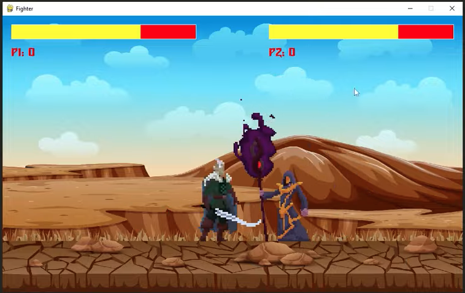

# Project Title: Street Fighter Game (Work-In-Progress)

## What is the project?

Aim: The aim of this project is to build a Street Fighter Game in python using the pygame library.

- Screenshot of Game UI

## Tech Stack

## What is the MVP?

## What are the sprinkles (Nice to haves)?

## When will the project be complete?

## Adapted from:

Name: Coding With Russ

Project Name: Street Fighter Style Fighting Game in Python using Pygame - Complete Tutorial

Youtube: https://www.youtube.com/watch?v=s5bd9KMSSW4

Github: https://github.com/russs123/brawler_tut
